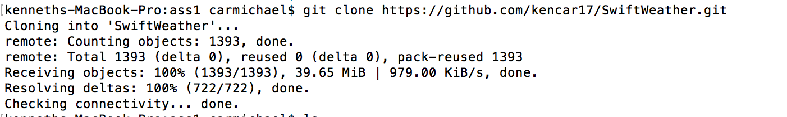
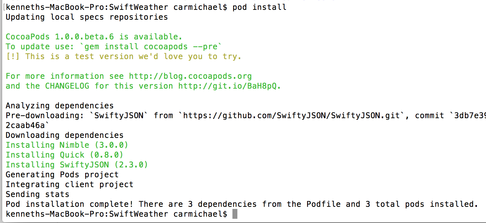
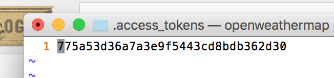
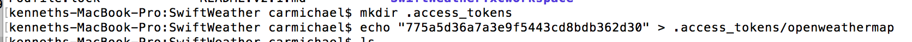
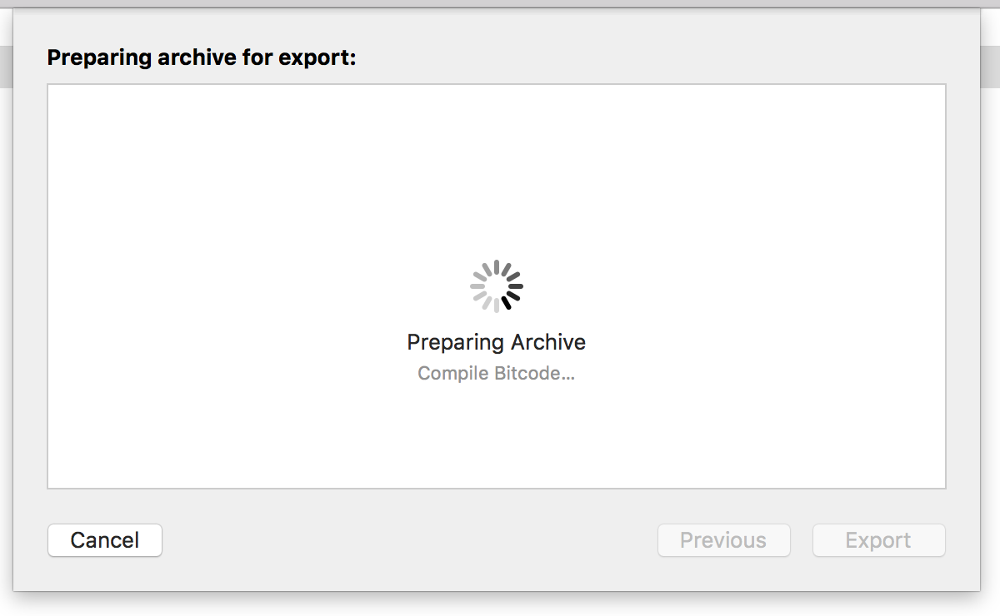
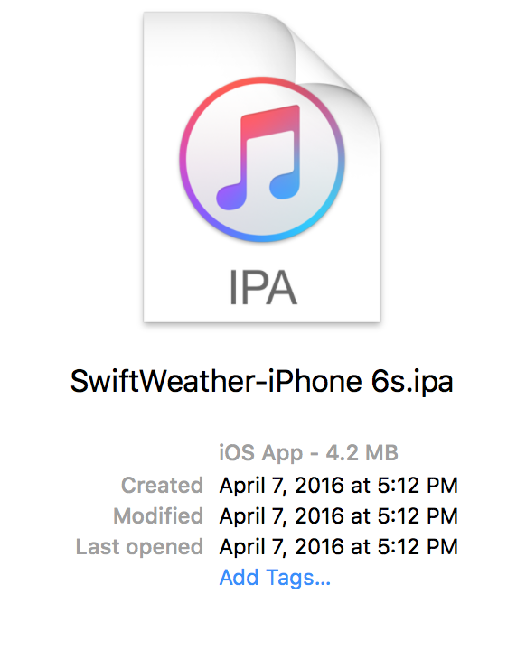
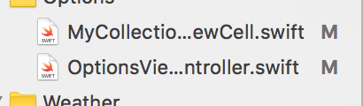
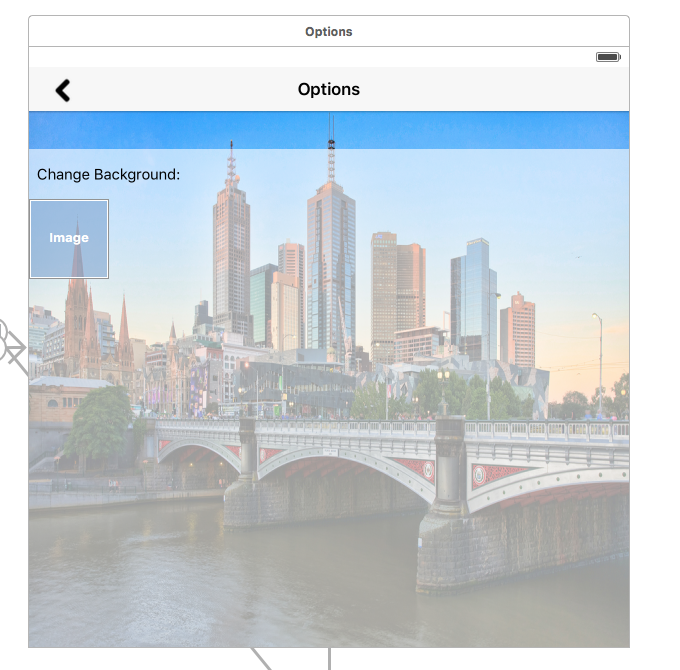
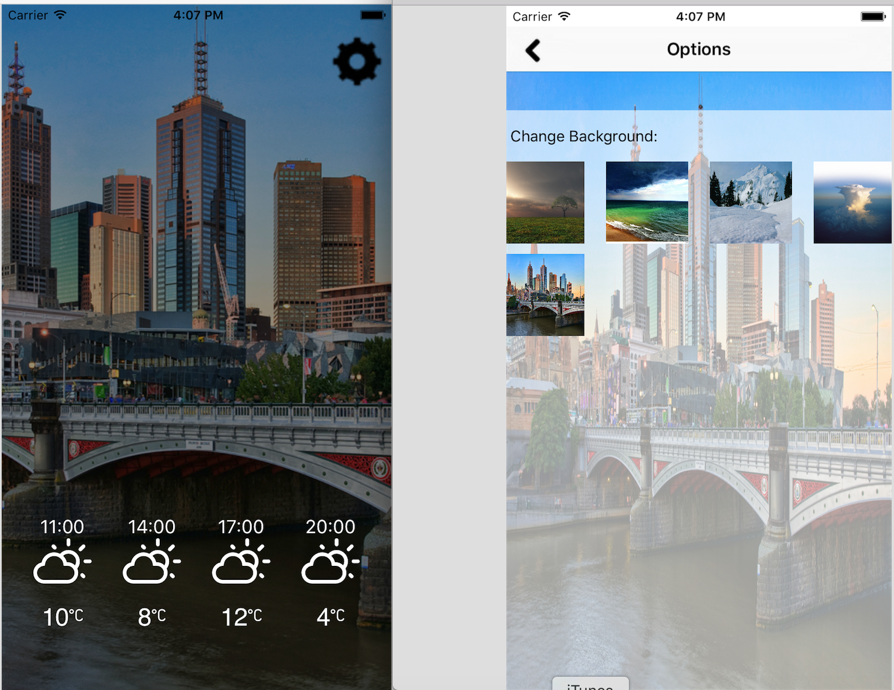

#SwiftWeather

SwiftWeather  is an iOS weather app developed in Swift 2. 

## Install Instructions That worked for me. (Artifact One)

  Once I decided to work on this application I forked the project into a repo in under my account, and then
cloned the project down to my local machine to begin working on it.

###These are the steps I took to get the project to work on my machine:

- Step One: Clone the project down to my machine via command line. The following screen shot illustrates
             the pod cloning of the repo down to my machine.

- Step Two: Next I cd in SwiftWeather, and had to do a pod install to install the necessary dependencies. The 
            following screen shot illustrates thr pod install. 

- Step Three: Now I had to cd  into "SwiftWeather.xcworkspace", and make a directory called .access_tokens and 
              echo in an appID. To get the appId I had to sign up on [openweathermap.org/appid](http://openweathermap.org/appid. The first screen shot shows the appId i got and the
              screen shot is echoing it into the file.

- Step Four: Now I was able to complie and run the app on the simulator, but one thing I had to do was change the
            location in the simulator -> debug -> location. At this point I was able to get the app to run on my
            machine.

- Step Five: I decided at this point to take it a step further and make a archive and then with that archive make
            a .ipa file so that I can test the app on my Iphone.

- In summary i was able to install the project, get it to work on my machine in the simulator, and then I took it
  a step further and made an archive and .ipa to try the app on my phone. In the test I did on my phone the app worked
  fine and did what it was suppose to do, but i did notice that the app would sometimes show St. Albert weather instead
  of Edmontons weather.

## Add Feature to change background (Artifact Two)

  In the process of playing around with the app, I did not reallt care about the background that much. So i decided on
adding a feature where you can change your background to one that you would like more.

  To accomplish this task I created two files.
  
  
  
  - OptionsViewController.sift:
      - Handles the GUI elements of the View.
        - I used a Navigation bar 
        - Collection View
        - UIImage
        - Label
        - Prototype cell
      - The Controller handles the displaying the background into the collections view. It also handles
        if a user selects a image and changes the background with the selected image. As well the controller
        handles going back to the main view. 
      - Also the Controller also handles passing data between the two controllers via a segue. This is used to
        pass the current background between the two views.

  
  
  The controller can be found [here] (https://github.com/kencar17/SwiftWeather/blob/blog/SwiftWeather/OptionsViewController.swift).

  - MyCollectionViewCell.swift
      - Handles the prototype cell used by the collection view.
      - All this file does is it creates a cell to be used with the collection cell.
      - This file holds a IBOutlet for a UIimage

  The ColectionViw cell can be found [here] (https://github.com/kencar17/SwiftWeather/blob/blog/SwiftWeather/MyCollectionViewCell.swift).
  
  
  Here is what the app looks like in the simulator with my additions (For some reason the simulator did not want to
  show the location):
  
  
  
