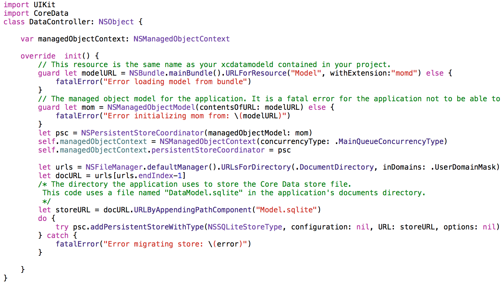
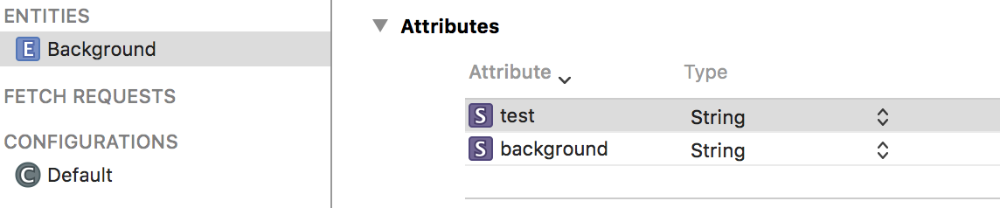
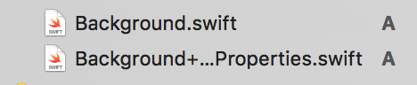
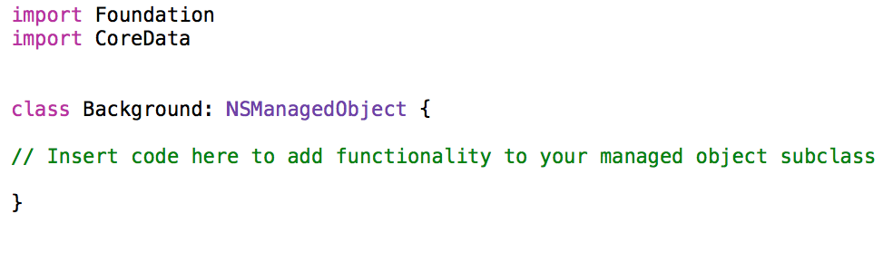
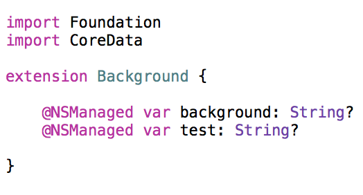
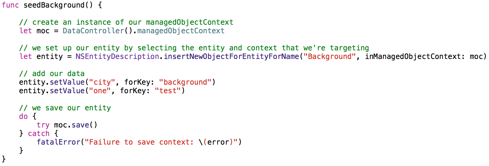
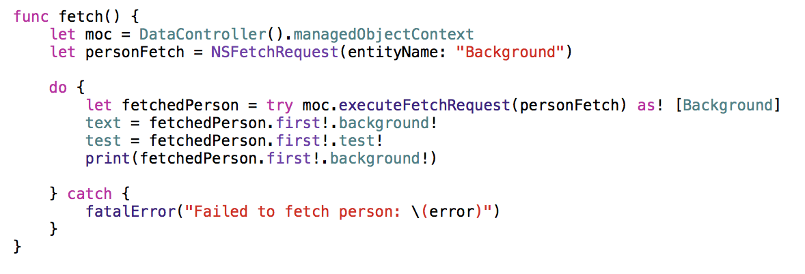
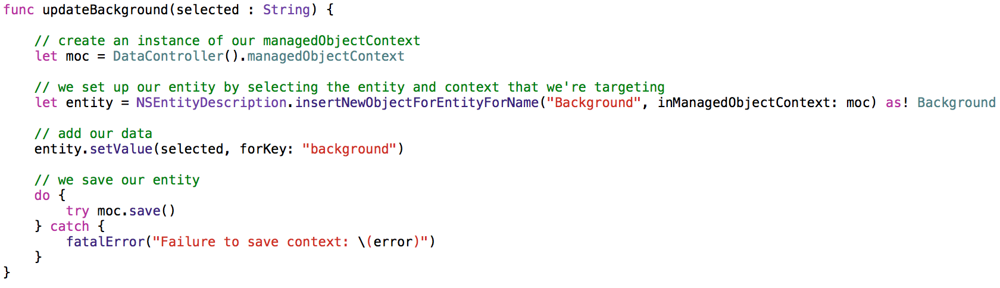
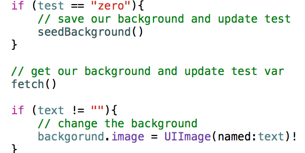
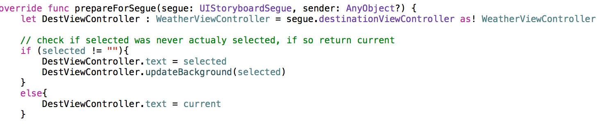

#SwiftWeather Continued..

## Tried Adding CoreData to the project (Failed) (Artifact 3)

After I added the feature to change the background, I deicded it wasnt pratical to keep changing it
everytime you open the app. So I decided to try add CoreData, in other words permanent storage to
the project. I got the CoreData to work so that I could seed the database and fetch from it, but I
ran into the problem where I could not update the Data with a new background. The following steps and
screen shots was my attempt at adding CoreData.

####Step One: Add CoreData to the Project
  - The first thing I did to setup CoreData was to create a data Model
  - And the Second thing was setup the stack
  
  ##### Model and Stack setup Files
  
  ##### Stack file itself
  

####Step Two: Add an entity
  - The next thing I was to create a entity for the data to be stored in.
  - This entity holds what the background is set to and a test var that is to test if we need to seed

  
  
####Step Three: Create NSManagedObject Subclass
  - Now after creating the entity, we create the NSManageObject subClasses that hold the information.
  - For this project there is just one: Background that holds both vars.
  ##### Files
  
  
  ##### Background File
    - This file is where you add functionality to your managed object subclass
  
  ##### Extension of the Background File
    - This file holds the actually variables 
  

####Step Four: Imnplement a seeder and fetch and Update functions
  - Now I implemmented a seeder and fetch and update functions in the weatherViewController
  
  #####Seeder
  
 - This file seeds the init background of the app. This would happen when you first would install the
  app.
 
  
  
  #####Fetch
  
  - This file fetchs the background saved in the data model.
  
  
  
  #####Update
  
  - This file updates the information in the data model. This happens when a user changes the background.
 
  
  
####Step Five: We call the functions where we want to do the operations.
  - Now I placed seeder and fetch functions into the ViewDid load function in WeatherViewcontroller
  
  
  
  - The update function I placed it in my segue in OptionsViewController.
  
  

####Step Six: Test
  - Among testing my implementation I could not figure out on how to get the CoreData to update properly. I was able to
  change the background but when I went back to the main view, the changes would not stick. So at this point I checkouted
  all the files I changed and added.
  
  
## Pull Request (Artifact 4)
  - After I undid all the changes and additions I made for the CoreData, I went back and performed tests to make sure that
  I did not break anything and that it still worked. The PR only contained my feature that I added.
  
